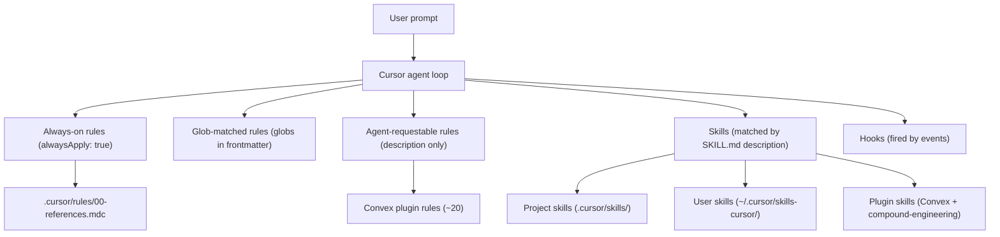

# Cursor Tooling

How the Cursor agent is shaped when working in this repo: what lives in
`.cursor/`, the four activation mechanisms (settings, rules, skills, hooks),
and the broader surrounding landscape (user-level skills, plugin-shipped
rules and skills) that show up alongside the project's own configuration.

**Snapshot as of: 2026-04-29.** Project-tracked material in `.cursor/` is
authoritative and version-controlled. The user-level and plugin-shipped
inventories below describe the surface area visible *from this developer's
machine on this date* — they vary per developer (user-level skills are in
`~/.cursor/`) and drift over time as plugins update. Treat that section as
illustrative, not canonical.

## What's tracked in this repo

```
.cursor/
├── settings.json              # Plugin config
├── rules/
│   └── 00-references.mdc      # alwaysApply: true
└── skills/
    └── grill-me/SKILL.md      # invoked on demand
```

Three things, total. The plugin config:

```1:7:.cursor/settings.json
{
  "plugins": {
    "convex": {
      "enabled": true
    }
  }
}
```

And the only always-on rule, identifiable by its frontmatter:

```1:4:.cursor/rules/00-references.mdc
---
description: Reference projects available as read-only inspiration
alwaysApply: true
---
```

Everything else the agent appears to "know" — Convex schema conventions,
git commit playbooks, frontend design rubrics, and so on — comes from
plugins listed in `settings.json` or from skills installed under
`~/.cursor/`. None of that lives in this repo.

## The four mechanisms

### 1. `settings.json` — static project config

Plain JSON. Activates plugins for everyone who opens this workspace in
Cursor. Loaded automatically; no agent decision involved.

### 2. Rules (`.cursor/rules/*.mdc`) — frontmatter decides activation

Markdown-with-frontmatter files. The frontmatter determines *when* the
rule's body is injected into the agent's context.

| Frontmatter             | When it loads                                                    |
| ----------------------- | ---------------------------------------------------------------- |
| `alwaysApply: true`     | Every chat/agent turn in this workspace                          |
| `globs: [...]`          | Auto-attached when matching files are open or edited             |
| `description: "..."` only | Agent-requestable — pulled in when the agent judges it relevant |
| (no frontmatter flags)  | Manual only — loaded when explicitly `@`-mentioned               |

This repo currently ships a single always-on rule
(`.cursor/rules/00-references.mdc`). Path-scoped (`globs:`) rules are a
good fit when guidance only applies to a subtree, e.g. "lint conventions
for `apps/web/`."

### 3. Skills (`SKILL.md`) — on-demand playbooks

Skills are larger procedural recipes, often with sub-files and scripts.
A skill's `description` frontmatter field is the activation hint: the
agent reads `SKILL.md` when your prompt matches the description. Skills
are **never auto-injected** — they cost zero context until invoked.

This repo ships one project skill:
[`.cursor/skills/grill-me/SKILL.md`](../.cursor/skills/grill-me/SKILL.md),
which interviews the user about a plan one question at a time.

### 4. Hooks (`.cursor/hooks.json`) — event-driven scripts

Hooks wire shell scripts to Cursor agent events (before-tool, after-edit,
on-prompt, etc.). They run automatically whenever their event fires; the
agent doesn't choose. **No hooks are configured in this repo.** The
user-level `create-hook` skill is the right tool to author one if needed.

## Decision matrix

If you read one section, read this.

| Mechanism                                    | Loaded into context…                              | Decided by             |
| -------------------------------------------- | ------------------------------------------------- | ---------------------- |
| `settings.json`                              | Always (project boot)                             | Static config          |
| Rule with `alwaysApply: true`                | Every turn                                        | Frontmatter            |
| Rule with `globs:`                           | When matching files are open or edited            | Frontmatter + context  |
| Rule with `description:` only                | When agent judges it relevant                     | Agent                  |
| Rule with no flags                           | Only when `@`-mentioned                           | You                    |
| Skill (`SKILL.md`)                           | When agent matches `description` to your prompt   | Agent                  |
| Hook (`hooks.json`)                          | When its event fires                              | Cursor runtime         |

## The wider landscape

Three sources contribute material to the agent at runtime. Only the first
is in this repo.

### Project-level (in this repo)

- **1 rule:** `.cursor/rules/00-references.mdc` — always-on; defines the
  read-only `references/` etiquette and lineage recording in
  [docs/inspiration.md](inspiration.md).
- **1 skill:** `.cursor/skills/grill-me/SKILL.md` — invoked on phrases
  like "grill me" or when stress-testing a plan.

### User-level (`~/.cursor/skills-cursor/`)

These follow the developer across all Cursor projects and **are not
shared via this repo.** Different teammates will have different sets.
Categories observed on 2026-04-29:

- **Workflow helpers** — e.g. `babysit` (keeps a PR merge-ready),
  `split-to-prs` (splits work into reviewable PRs).
- **Authoring** — `create-rule`, `create-skill`, `create-hook` for
  building new Cursor configuration from a guided template.
- **Cursor configuration** — `statusline`, `update-cursor-settings` for
  tweaking the IDE itself.
- **Visual artifacts** — `canvas` (live React-app artifacts beside the
  chat).

Run `ls ~/.cursor/skills-cursor/` to see your current set.

### Plugin-shipped (cached under `~/.cursor/plugins/cache/cursor-public/`)

Activated by entries in [.cursor/settings.json](../.cursor/settings.json).
The plugin's manifest brings rules and skills into scope automatically.

- **Convex plugin** (currently enabled). Adds roughly 20
  agent-requestable rules covering argument validation, schema design,
  authentication checks, query optimization, scheduler usage, and the
  TypeScript-strict / no-`any` posture; plus around 7 skills:
  `convex-quickstart`, `auth-setup`, `schema-builder`, `function-creator`,
  `migration-helper`, `convex-helpers-guide`, `components-guide`. Cache
  folder: `~/.cursor/plugins/cache/cursor-public/convex/`.
- **compound-engineering plugin** (installed at user level, observed in
  this workspace). Roughly 30 skills grouped by phase of work:
  - *Planning:* `ce-brainstorm`, `ce-plan`, `ce-ideate`.
  - *Execution:* `ce-work`, `ce-debug`, `ce-optimize`, `ce-worktree`.
  - *Git / PR flow:* `ce-commit`, `ce-commit-push-pr`, `ce-pr-description`,
    `ce-resolve-pr-feedback`, `ce-clean-gone-branches`.
  - *Review:* `ce-code-review`, `ce-doc-review`.
  - *Frontend:* `ce-frontend-design`, `ce-test-browser`, `ce-demo-reel`.
  - *Meta / knowledge:* `ce-sessions`, `ce-compound`, `ce-compound-refresh`,
    `ce-slack-research`, `ce-proof`.

  Cache folder: `~/.cursor/plugins/cache/cursor-public/compound-engineering/`.

For the live list of skills in either plugin, `ls` the cache folder. The
counts above are a snapshot.

## Activation flow



The table answers *when* each mechanism fires; the diagram answers *where
the material comes from* — project tree, the developer's home directory,
or a plugin cache.

## Extending

To add new agent guidance to this repo:

- **Rule** — create `.cursor/rules/<name>.mdc` with a frontmatter block
  (`alwaysApply`, `globs:`, or `description:` only). The user-level
  `create-rule` skill walks through the choice.
- **Skill** — create `.cursor/skills/<name>/SKILL.md` with a `name` and
  `description` in frontmatter, plus a body describing the procedure.
  The user-level `create-skill` skill is the guided path.
- **Hook** — create `.cursor/hooks.json` and the corresponding scripts.
  The user-level `create-hook` skill covers the event surface.

User-level and plugin-shipped material is intentionally not extended from
inside this repo — those are per-developer / upstream concerns.
